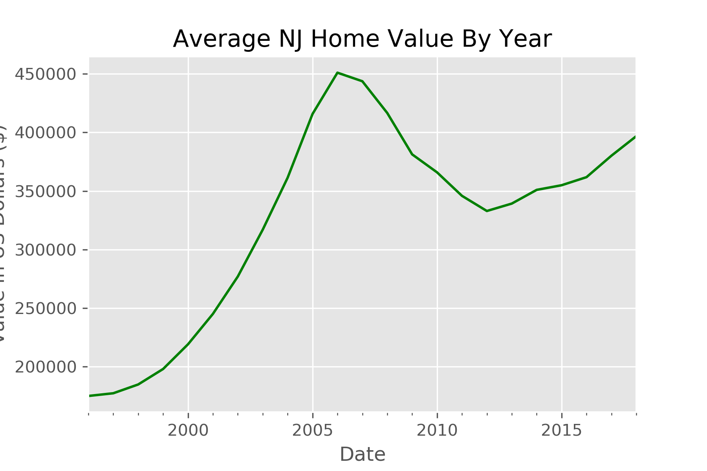
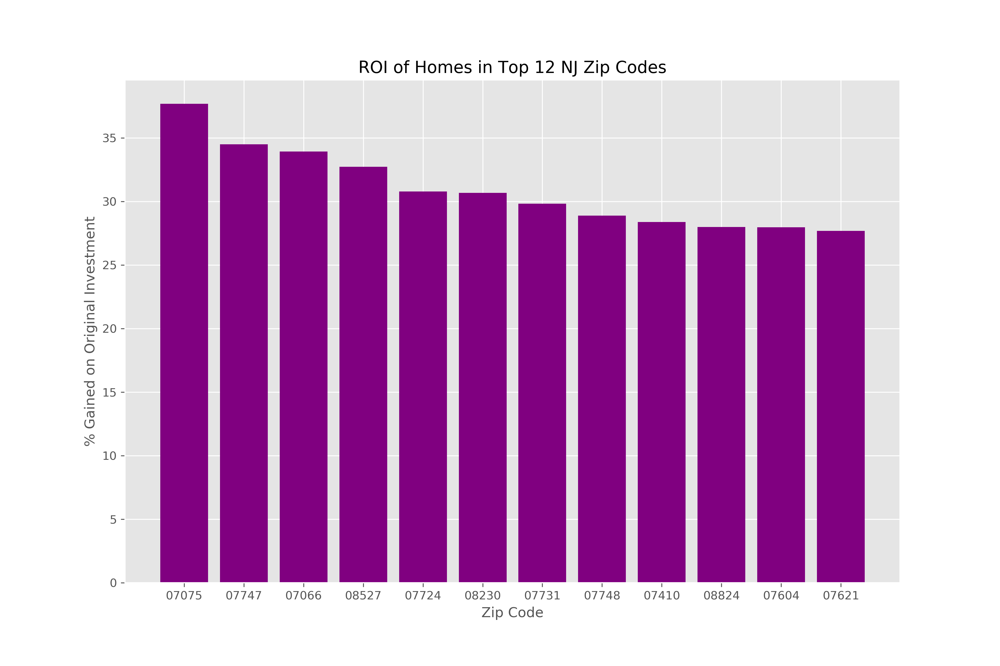
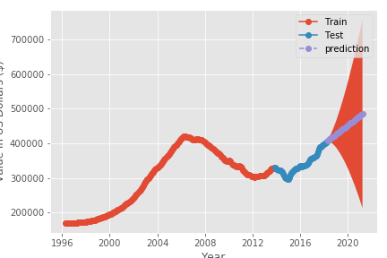
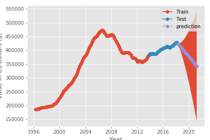
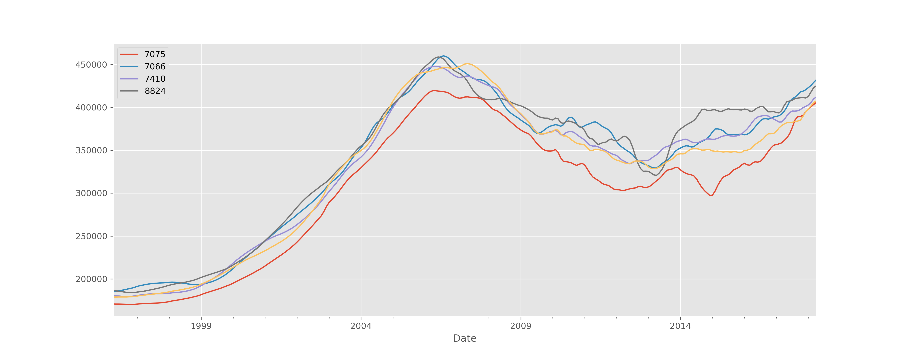

# Zillow Time Series Analysis

By Dave Brown

## Business Problem

A real estate firm wants to know what are the top 5 zip codes to flip homes. We must determine where we wan to look, how much data to use, and how to describe best.

1) For this project, we will only include data from New Jersey.

2) Because of the housing market crash and Hurricane Sandy, any modelling that uses only recent years may be misleading. We will use every value from 1996 to 2018 so we can the most accurate picture of home values in NJ through the years.

3) To define best, we will take the home values from the beginning and the end of the dataset to calculate the total ROI. Then, through our time series analysis, we will find the 5 zip codes with the best outlooks.

## Methodology

Originally, there were 14,723 unique zip codes in this dataset. This was cut down to 502 zip codes from New Jersey. To narrow down the list even more, we calculated the ROI, while also accounting for the coefficient of variation. This was included so the majority of home values were within a certain range. By only calculating the ROI alone, the data would be affected by zip codes that have a large number of outliers. 

After narrowing down the list by only including zipcodes within the 30 and 70 percent quartiles of the average home value, we were left with 200 zip codes. From our final list, we selected the top 12 in ROI to be analyzed.

## Analysis

After finding our best model, we ran the home values for each zip code, and found the test data, train data and prediction. Some predictions showed positive returns ...

while others showed a poor outlook...

## Findings

Once the modelling portion was completed, we were left with 5 zip codes that showed positive predictions, 07075, 07066, 07410, 08824, and 07604. Zip codes 07066, 07410, and 08824 showed a benefit in flipping homes within the next 1 to 3 years, while it was better to wait years before selling a property in 07075 and 07604.

## Further Work

This project was purely based on using past home values in order to predict future results. To create a more detailed analysis, we could look at school rankings, distance to metro areas, property sizes, tax rates, interest rates, and the future economic market.

## For More Information

## For More Information

Please review my full analysis in my [notebook](/ts_notebook.ipynb) and my [presentation](/).

For any additional questions, please contact Dave Brown: davebrown271@gmail.com.

## Repository Structure

#### Main Page
    ├── README.md                              <- The top-level README for reviewers of this project
    ├── ts_notebook.ipynbb                     <- The notebook for the analysis
    ├── images                                 <- The folder containing the images used for the presentation